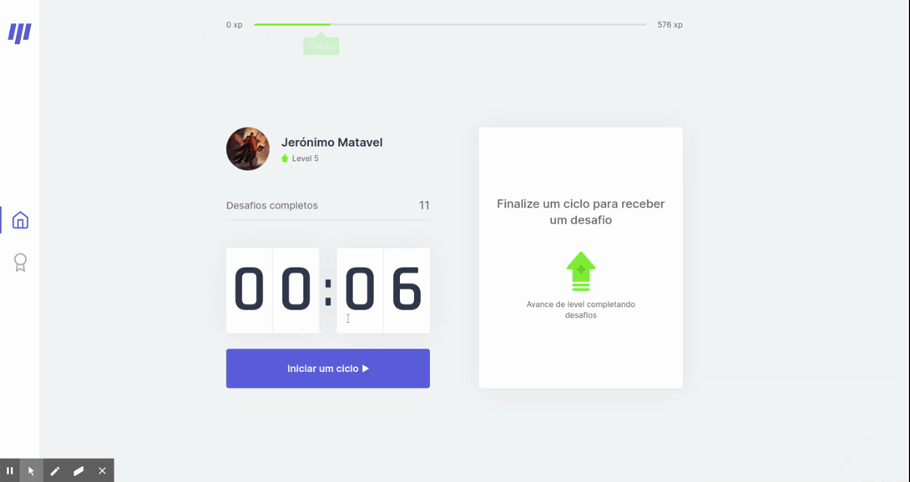

<h1 align='center'>
    
</h1>
<h1>
    
</h1>

<p align='center'>
<a href='https://nlw4-react.vercel.app/'>Veja a demonstração do Projecto</a>
</p>

## 💻 Sobre o projeto

O [move.it](https://nlw4-react.vercel.app/) é baseado na técnica de pomodoro e tem como objetivo ajudar quem fica na frente do computador por um longo período e acaba deixando de se exercitar, desafiando o usuário de uma forma divertida.

O Projeto foi desenvolvido durante quarta edição da **NLW - Next Level Week** oferecida pela [Rocketseat](https://blog.rocketseat.com.br/primeira-next-level-week/).
O NLW é uma experiência online com muito conteúdo prático e desafios que ficam disponiveis durante uma semana.


## Como Iniciar o projecto na sua máquina


```bash
    # Primeiro, clone o repositório para sua máquina
    $ git clone git@github.com:Jeronimo-MZ/nlw4-react.git
    
    # entre no directório do projecto
    $ cd nlw4-react

    # instale todas as dependências
    $ yarn add

    # inicie o projecto no servidor local
    $ yarn dev
```

abra [http://localhost:3000](http://localhost:3000) no seu navegador para acessar o projecto

## 🚀 Tecnologias utilizadas

O projecto foi desenvolvido usando as seguintes tecnologias:

- [ReactJS](https://reactjs.org/)
- [NextJS](https://nextjs.org/)
- [TypeScript](https://www.typescriptlang.org/)
- [Yarn](https://yarnpkg.com/)
- [CSS](https://developer.mozilla.org/pt-BR/docs/Web/CSS)
- [HTML](https://developer.mozilla.org/pt-BR/docs/Web/HTML)

## 🚀 Deploy

O deploy do projecto foi feito na [Vercel](https://vercel.com/) e pode ser encontrado [neste link](https://nlw4-react.vercel.app/)

## 🦸 Autor 

<a href="https://github.com/Jeronimo-MZ">
 
 <br />
 <b>Jerónimo Matavel</b></a> <a href="https://www.linkedin.com/in/jeronimo-matavel/" title="Jerónimo Matavel">🚀</a>
 <br />

 [](https://www.linkedin.com/in/jeronimo-matavel/) 
[](mailto:mataveljeronimo@gmail.com)

---

## 📝 Licença

Este projeto esta sob a licença [MIT](./LICENSE). Consulte  a [LICENÇA](./LICENSE) para detalhes.

Feito com ❤️ por Jerónimo Matavel 👋🏽 [Entre em contato!](https://www.linkedin.com/in/jeronimo-matavel/)